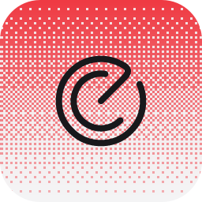

<p align="center">
  <picture>
    <source media="(prefers-color-scheme: dark)" srcset="./icon-dark.png" />
    
  </picture>
</p>

<div align="center">

# Monitors

</div>

Price / stock / keyword / content-diff / uptime watches with cross-device notification fan-out.

> **The public home of `ryu-monitors`.** Source, builds, and releases live here —
> binaries for every platform are attached to each release.
>
> This tree is generated from the Ryu monorepo, so commits pushed here
> directly are replaced on the next sync. **Pull requests are welcome** —
> open them here and they are ported into the monorepo, then flow back out.
> Ryu as a whole: https://github.com/amajorai/ryu

## Install

**App:** [Install](ryu://apps/@ryu/monitors) (opens the Ryu desktop app and asks you to confirm)

**CLI:**

```bash
ryu apps add @ryu/monitors
```

**Crate:**

```bash
cargo install ryu-monitors
```

Prebuilt binaries for every platform are attached to [each release](https://github.com/amajorai/ryu/releases).

## License

Apache-2.0 — see [LICENSE](./LICENSE).

## Parts

- **`backend/` (`ryu-monitors`)** — an extracted Core capability crate: the check engine,
  the SQLite `MonitorStore`, and the `/api/monitors/*` HTTP surface. **Now served
  OUT-OF-PROCESS** by the `ryu-monitors` bin (`[[bin]]`, `kind:local`, `public_mount`,
  `RYU_MONITORS_BIN`/`RYU_MONITORS_PORT`, default `:8003`); Core links **zero monitor code**
  (no path-dep). Its scheduler-coupling (check run + backing-job reconcile) reaches the
  sidecar over loopback via `apps/core/src/monitors_client.rs`, and the sidecar reaches BACK
  via two ext-bearer host callbacks (Spider fetch + alert fan-out). **The shared
  notification-delivery store no longer lives here** — it was extracted to the kernel crate
  `ryu-notify` + `apps/core/src/notify/` (see the repo root); the sidecar shares only the
  dep-light `ryu-notify` wire types. Remaining cross-cutting calls are inverted through the
  `MonitorsHost` trait, so the crate has **zero dependency on `apps/core`**.
- **`ui/` (`@ryu/monitors-app`)** — the companion surface: a React app built to one
  self-contained HTML via `vite-plugin-singlefile`. Full-page Companion (Path B,
  `ui_format: "html"`).

## Manifest

- **id** `@ryu/monitors` · companion `Monitors` (icon `radar`).
- **grant** `monitors:crud` — the bridge capability the UI drives `/api/monitors/*`
  through.

## Surface

`/api/monitors` (list/create) · per-monitor `run`, `snapshots`, `alerts` · `alerts` +
`alerts/stream` (SSE) + `alerts/:id/ack` · `push-tokens` (Expo device registration).

## Swap seam

Check type and fetch backend are both extensible enums routed through one engine; timing
reuses Core's scheduler (`JobTarget::Monitor`). Notification targets (webhook / Telegram /
Expo push / BYO SMTP email) are per-monitor, none hardcoded.
